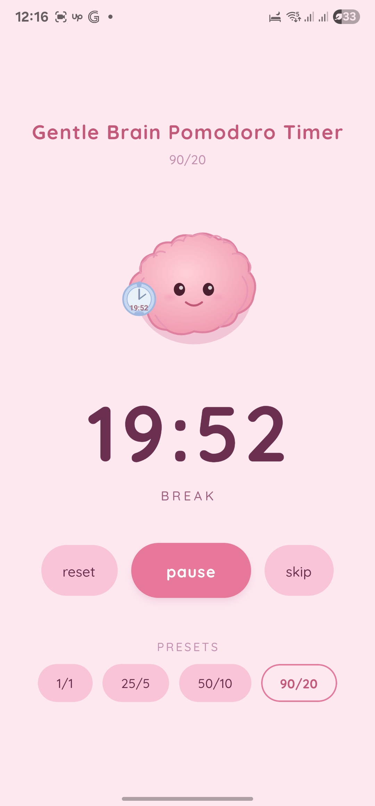

# Gentle Brain Pomodoro Timer

A cute Pomodoro timer app built with React Native + Expo — created for tutorial purposes as a learning exercise for myself, personally, transitioning into mobile development with React Native and Expo.

## Preview

## Tech Stack

- [React Native](https://reactnative.dev/)
- [Expo](https://expo.dev/) (managed workflow, blank TypeScript template)
- [react-native-svg](https://github.com/software-mansion/react-native-svg) — SVG rendering
- [react-native-safe-area-context](https://github.com/th3rdwave/react-native-safe-area-context) — safe area handling
- [expo-font](https://docs.expo.dev/versions/latest/sdk/font/) + [Quicksand](https://fonts.google.com/specimen/Quicksand) — custom fonts
- TypeScript

## Features

- Pomodoro timer with focus and break phases
- Auto-switches to break when focus ends
- Preset durations (25/5, 50/10, 90/20)
- Start, pause, reset, skip controls

## Notes

- This is a learning project, not production-ready
- Built on the `blank-typescript` Expo template (no Expo Router)
- Styles intentionally kept in the same file as components for readability while learning
- `theme.ts` centralises all design tokens for easy theming later
